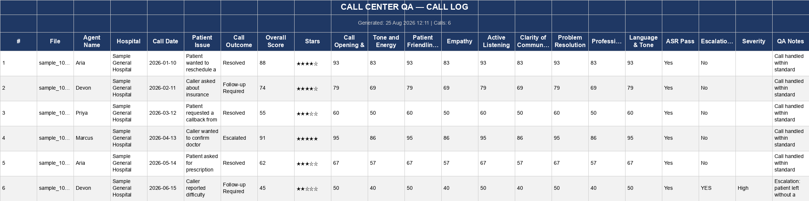
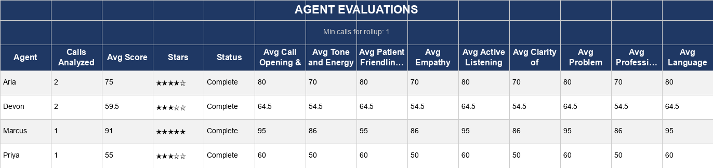
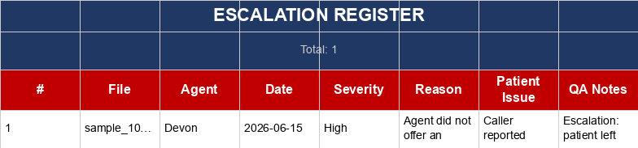
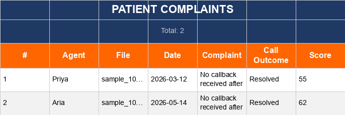

# PolyVox

**Multilingual call QA, automated** — telephony export → transcription → AI scoring → Excel reports.

*Built for a multilingual healthcare call center. Client, agent, and patient identifiers are not disclosed — see [Privacy note](#privacy-note) below.*

---

## The problem

Call centers face three bottlenecks at once:

1. **Manual QA doesn't scale** — managers can only listen to a fraction of calls; scores vary by reviewer.
2. **Multilingual recordings** — English, Hindi, Telugu, and more make consistent human review slow and expensive.
3. **Data without deliverables** — CDR exports pile up, but QA teams need structured Excel reports they can act on the same week.

PolyVox closes that gap: ingest a CSV, run overnight, deliver four workbooks.

---

## What it does

```
telephony CSV  →  fetch MP3s  →  transcribe (ASR cascade)  →  Claude KPI scoring  →  Excel reports
```

| Output | Purpose |
|---|---|
| **CALL_LOG** | Every call scored on 9 KPIs with QA notes |
| **ESCALATIONS** | Behavioral flags (rude/dismissive) — not low scores alone |
| **PATIENT_COMPLAINTS** | Complaints extracted per call |
| **AGENT_EVALUATIONS** | Per-agent rollup + training recommendations |

Designed for **100+ calls per cohort**, batched and **resume-safe** (restart after rate limits without redoing finished work).

### Sample output






*Fabricated end-to-end — fake agents, fake hospital, fake complaints — generated by the real report code (`packages/callqa/callqa/reports/`) so the format and colors match actual output exactly. Sample workbooks: [`docs/sample_reports/`](docs/sample_reports/).*

---

## Privacy note

This is a portfolio-facing repo for client work. Per client confidentiality terms:

- No real hospital, agent, or patient names, phone numbers, or call recordings are committed here.
- Screenshots and sample workbooks above use synthetic data only.
- Any client-specific logic (filename formats, hospital name variants, disposition mappings) lives in code but is written generically enough to require no real identifiers to understand or reuse.

---

## Results

- **Time** — hours of manual listening replaced by an automated batch pipeline
- **Consistency** — the same weighted KPI rubric applied to every call
- **Actionable** — four Excel reports QA can share with team leads immediately

---

## Stack

Python · Groq Whisper / AssemblyAI / faster-whisper · Claude · pandas · openpyxl

Configurable via `config.yaml`: agents, KPI weights, ASR thresholds, language hints, analysis profile.

---

## Quick start

```bash
python3 -m venv .venv && source .venv/bin/activate
pip install -r requirements.txt
cp .env.example .env   # ANTHROPIC_API_KEY, GROQ_API_KEY

# Add your telephony CSV at data/calls.csv (see data/README.md)
python 0_fetch_csv.py --dry-run
python run_all.py          # small cohorts
./run_pipeline.sh          # large cohorts
```

---

## Project layout

```
polyvox/
├── 0_fetch_csv.py … 3_report.py    # thin CLI entrypoints
├── packages/callqa/                # actual pipeline: ingestion, transcription, analysis, reports
├── apps/cli/                       # unified callqa CLI
├── docs/sample_reports/            # synthetic .xlsx samples (safe to share)
├── docs/screenshots/               # README images, generated from the samples above
├── config.yaml                     # KPIs, agents, ASR settings
└── templates/healthcare.yaml       # generic scoring template
```
