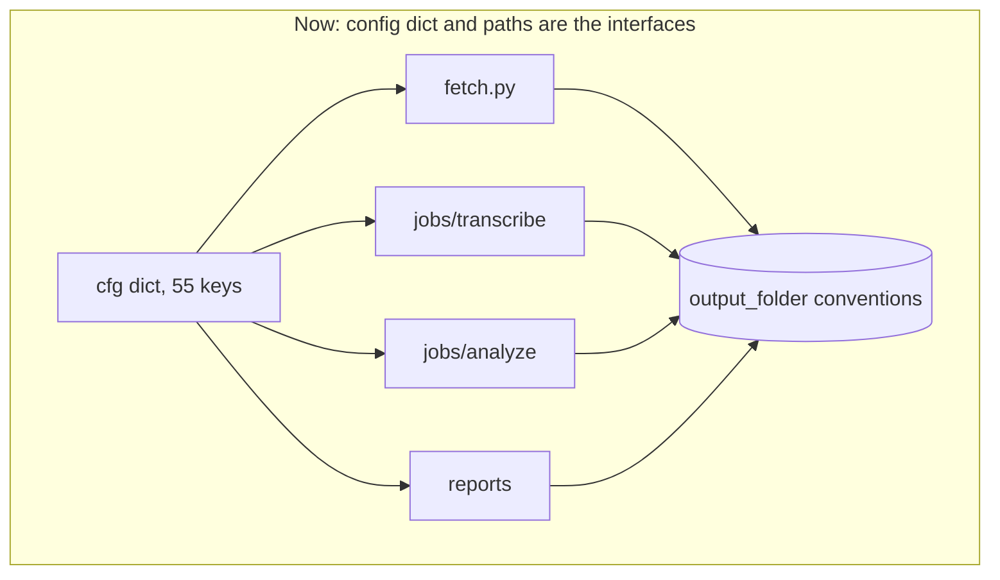
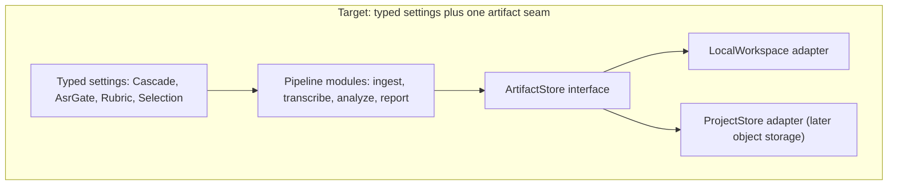
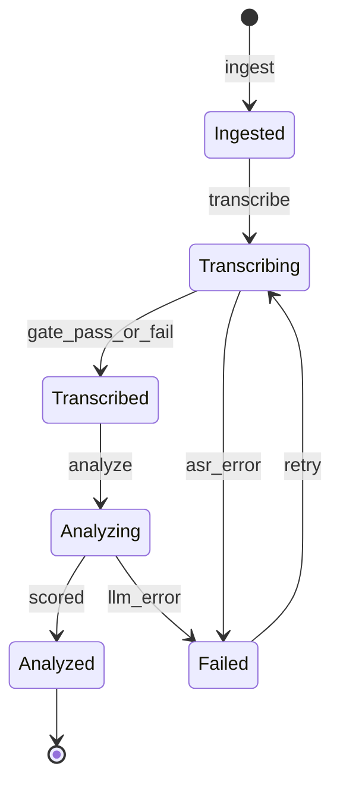

# PolyVox — Phase-wise Rebuild Plan

**Goal:** turn a Rainbow-specific batch pipeline into a sellable call-QA product for QA heads at small companies: upload recordings, get scored calls and agent coaching **on the web**, with Excel as an export rather than the deliverable.

**Status:** Phase 0 in progress. Phases 0-2 are planned in detail below. Phases 3+ are intentionally coarse and get sub-phases only when we reach them.

Architecture vocabulary in this document follows [.cursor/skills/codebase-design/SKILL.md](../.cursor/skills/codebase-design/SKILL.md): **module**, **interface**, **depth**, **seam**, **adapter**, **leverage**, **locality**, and the **deletion test**.

---

## 1. Architecture review — what actually blocks the product

The engine works, but its **interfaces** are shaped for one operator running one hospital cohort. Product work will fight these seven frictions. Evidence is from the current tree.

### D1 — `cfg: dict` is a 55-key implicit interface (Strong)

**Files:** all 18 modules under [packages/callqa/callqa](../packages/callqa/callqa) — 95 `cfg[...]` / `cfg.get(...)` sites, **55 distinct keys**.

Every module accepts the whole config dict, so its **interface** is "the type signature plus whichever of 55 keys I happen to read." A caller of [asr_gate.evaluate](../packages/callqa/callqa/transcription/asr_gate.py) cannot tell from the signature that `asr_thresholds`, `asr_repetition_ngram`, and `asr_min_words_per_minute` are load-bearing. This is the classic **shallow** shape: the interface is as complex as the implementation, just undocumented.

**Deepen:** construct typed settings at the edge (`AsrGateSettings`, `CascadeSettings`, `RubricSpec`, `SelectionSettings`) and pass those. **Leverage:** callers learn 3 fields instead of 55. **Locality:** invalid config fails in one constructor instead of at hour two of a batch run. **Test surface:** build a settings object in a test rather than assembling YAML fixtures.

### D2 — The filesystem layout is a leaking seam (Strong)

**Files:** 20+ path computations across 9 modules, e.g. `os.path.join(cfg["output_folder"], "analysis")` in [jobs/analyze.py](../packages/callqa/callqa/jobs/analyze.py), [reports/templates_v1.py](../packages/callqa/callqa/reports/templates_v1.py), [reports/aggregator.py](../packages/callqa/callqa/reports/aggregator.py), [state/manifest.py](../packages/callqa/callqa/state/manifest.py), [state/metadata.py](../packages/callqa/callqa/state/metadata.py), plus root scripts.

Directory conventions are the de-facto integration seam, and every module re-derives them. Nothing can run per-project, per-tenant, or against object storage without editing all nine.

**Deepen:** one `ArtifactStore` module — `store.transcript(call_id)`, `store.put_analysis(call_id, payload)`, `store.reports_dir()`. **Two adapters make it a real seam**, and we already have two: local white-glove folders today, per-project workspaces (later object storage) for the product. **Deletion test:** deleting `ArtifactStore` re-spreads path knowledge across nine modules — complexity reappears, so it earns its keep.

### D3 — `_merge_records` is duplicated (Strong, cheap)

[reports/templates_v1.py:64](../packages/callqa/callqa/reports/templates_v1.py) and [reports/aggregator.py:29](../packages/callqa/callqa/reports/aggregator.py) implement the same merge of analysis JSON with metadata sidecars. Straight duplication; the web report path will need a third copy unless one wins.

**Deepen:** keep `aggregator.merge_records` as the single module; reports and the API both consume it.

### D4 — `fetch.py` has no internal seams (Strong)

[ingestion/fetch.py](../packages/callqa/callqa/ingestion/fetch.py) is 527 lines doing CDR parsing, agent resolution, duration-bucket sampling, MP3 download, and manifest writing. The external **interface** (`run_fetch(cfg, dry_run)`) is pleasantly small, but the **implementation** has no internal seams, so the API upload flow cannot reuse sampling without also triggering downloads, and none of the four concerns is testable alone.

**Deepen:** keep the small external interface; add internal seams — `CdrSource` (adapter per CSV/XLSX/mapping), `AgentResolver`, `CallSampler`, `RecordingFetcher`. Depth is a property of the interface, so internal parts staying mockable is a feature, not a leak.

### D5 — Rubric logic lives in code, not data (Strong for product)

[analysis/plugins/generic.py](../packages/callqa/callqa/analysis/plugins/generic.py) hardcodes healthcare prompt copy, escalation policy, and disposition-mismatch rules, while [analysis/profiles.py](../packages/callqa/callqa/analysis/profiles.py) always returns that one profile. One adapter means a **hypothetical** seam — the indirection buys nothing today.

**Deepen:** make the rubric a data pack (`RubricSpec`: KPIs, weights, escalation policy, training modules, tone) consumed by one prompt builder. A second pack (generic contact center) turns the seam real.

### D6 — Disposition rules are hardcoded to one telephony vendor (Strong for product)

[state/disposition.py](../packages/callqa/callqa/state/disposition.py) maps Rainbow strings (`Appointment_Booked`, `No_Medical_Assistance`) to outcomes. Any second customer needs a fork.

**Deepen:** move rules into the rubric/mapping pack as data; keep a small `map_outcome(disposition, rules)` module.

### D7 — `excel_legacy.py` is a dead 863-line path (Strong — delete)

[reports/excel_legacy.py](../packages/callqa/callqa/reports/excel_legacy.py) is the older 7-workbook KIMS report set, reachable only when `report_template != "templates_v1"`. **Deletion test:** removing it makes complexity vanish rather than reappear — it is not earning its keep. Move to `legacy/` or delete once we confirm no live engagement depends on it.

### Current vs target shape





---

## 2. Phase map

| Phase | Outcome | Depth of planning here |
|---|---|---|
| 0 | Product foundation: de-client the engine, monorepo, typed seams | Detailed |
| 1 | Platform core: projects, jobs, API, web-readable results | Detailed |
| 2 | Web product MVP: QA head dashboard from `design/` | Detailed |
| 3 | Configurable analysis (rubric builder, model choice) | Coarse |
| 4 | Commercial layer (billing, metering, notifications) | Coarse |
| 5 | Integrations and scale (SFTP, webhooks, connectors) | Coarse |
| 6 | Enterprise tier (VPC, SSO, audit) | Coarse |

Phase order respects the locked hosting model in [decisions/0001-hosting-white-glove-short-retention.md](decisions/0001-hosting-white-glove-short-retention.md): we productize the UX before we productize customer data storage.

---

## Phase 0 — Product foundation

**Objective:** the engine stops assuming one hospital, one config file, and one output folder. Nothing customer-facing changes yet.

**Exit criteria**

1. No Rainbow/KIMS string decides behaviour in Python.
2. A second rubric pack runs end to end on sample data.
3. All artifact paths resolve through one `ArtifactStore` interface.
4. `packages/callqa` exposes a documented pipeline interface that the worker calls.
5. Existing tests pass; new tests construct settings objects, not YAML.

### Sub-phases

**0.1 — Monorepo layout** *(done)*

`apps/api`, `apps/web`, `apps/worker`, `design/`, `docs/` scaffolded alongside `packages/callqa`. Recorded as [decisions/0002-monorepo-layout.md](decisions/0002-monorepo-layout.md).

**0.2 — De-client the engine**

- Remove Rainbow/KIMS defaults from [state/metadata.py](../packages/callqa/callqa/state/metadata.py) (`hospital: "Rainbow"`, `royalbhrn` filename parsing) and [run_all.py](../run_all.py) (KIMSHEALTH email copy, "7 Excel reports").
- Move all healthcare copy into `templates/healthcare.yaml`; add `templates/generic.yaml`.
- Root `config.yaml` becomes a dev example, not the product config.

**0.3 — `ArtifactStore` seam (D2)**

Introduce the module and convert call sites file by file: `state/` first, then `jobs/`, then `reports/`. Two adapters from day one so the seam is real, not hypothetical.

**0.4 — Typed settings (D1)**

Start where thresholds hurt most: `AsrGateSettings` and `CascadeSettings`, then `RubricSpec` and `SelectionSettings`. Config loader becomes the only module that reads YAML.

**0.5 — Rubric packs as data (D5, D6)**

`RubricSpec` carries KPIs, weights, escalation policy, training modules, and disposition rules. `profiles.py` collapses into a pack registry once a second pack exists.

**0.6 — Prune dead paths (D3, D7)**

Delete the duplicate `_merge_records`; move `excel_legacy.py` out of the product path.

**0.7 — Pipeline interface**

```python
# packages/callqa/callqa/core/pipeline.py — shape, not final signature
ingest(source: CdrSource, mapping: ColumnMapping, selection: SelectionSettings) -> list[CallRef]
transcribe(call: CallRef, settings: CascadeSettings) -> TranscriptResult
analyze(call: CallRef, transcript: TranscriptResult, rubric: RubricSpec) -> AnalysisResult
export(calls: list[CallRef], fmt: Literal["xlsx"]) -> ExportArtifact
```

No filesystem paths in signatures; the store is injected.

### Phase 0 stack

| Concern | Choice | Why |
|---|---|---|
| Language | Python 3.11+ | Engine already here; ASR/LLM SDKs are Python-first |
| Settings | Pydantic v2 models | Validation at the edge, typed interfaces |
| Config source | YAML packs, loaded once | Operators already think in YAML |
| Tests | pytest | Existing suite in [tests/](../tests) |
| Lint/format | ruff | Single fast tool |

---

## Phase 1 — Platform core

**Objective:** a project-based backend that runs the pipeline asynchronously and returns web-ready results. UI can stay minimal; Swagger plus the current shell is enough.

**Exit criteria**

1. Create a project, drop in a CDR and recordings, run the pipeline, and read scored calls over HTTP.
2. Resume works: rerunning a project does not redo finished calls.
3. Retention job deletes media after `retention_days` (default 14).
4. A non-healthcare rubric pack runs end to end.
5. Excel export is one endpoint, not the only output.

### Sub-phases

**1.1 — Project and call model**

Entities: `Project` (engagement, retention), `Agent`, `Call` (status: `pending → ingested → transcribed → analyzed → failed`), `Transcript`, `Analysis`, `Job`, `RubricSnapshot`, `CdrMapping`.

Start with SQLite through SQLAlchemy so local white-glove runs need no services; Postgres is the same code path when a hosted tier arrives.

**1.2 — `CallRepository` (D3 from the review)**

Replace `pilot_manifest.json` plus per-call sidecars with a repository interface. Two adapters: JSON files (compat for in-flight engagements) and SQL. Manifest concepts survive as `Call.status` and job checkpoints.

**1.3 — Ingestion refactor (D4)**

`CdrSource` adapters for CSV and XLSX; `ColumnMapping` replaces hardcoded `Agent` / `Recording URL` / `Talk Time` column names. This is what makes a second telephony vendor a config change.

**1.4 — Job runner**



Jobs must be idempotent and resumable — the current skip-if-output-exists behaviour in [jobs/analyze.py](../packages/callqa/callqa/jobs/analyze.py) becomes an explicit checkpoint.

**1.5 — API v1**

- `POST /v1/projects`, `GET /v1/projects`, `GET /v1/projects/{id}`
- `POST /v1/projects/{id}/cdr` (upload), `POST /v1/projects/{id}/recordings`
- `POST /v1/projects/{id}/mapping` (column map), `POST /v1/projects/{id}/run`
- `GET /v1/projects/{id}/jobs`, `GET /v1/projects/{id}/calls`, `GET /v1/calls/{id}`
- `GET /v1/projects/{id}/agents` (rollup), `GET /v1/projects/{id}/export.xlsx`
- `DELETE /v1/projects/{id}/media` (manual purge)

**1.6 — Provider registry**

Move [adapters/](../packages/callqa/callqa/adapters) behind a registry with per-project enablement: ASR (`assemblyai`, `groq`, `faster-whisper`) and LLM (`anthropic`, room for others). Keys stay in environment, never in project rows.

**1.7 — Retention enforcement**

Scheduled purge honouring the locked policy; every project row records `purge_after`. Deleting media must not delete scores, so reports survive purge.

### Phase 1 stack

| Concern | Choice | Why |
|---|---|---|
| API | FastAPI + Uvicorn | Same language as engine; free OpenAPI for the web client |
| Validation | Pydantic v2 | Shared with Phase 0 settings |
| DB | SQLite via SQLAlchemy 2.x, Postgres-ready | Zero-ops for white-glove; one migration path later |
| Migrations | Alembic | Needed the moment real engagement data exists |
| Jobs | In-process background worker, ARQ + Redis when concurrency demands | Avoid infra we do not yet need |
| Storage | `ArtifactStore` local adapter | Locked hosting model: no permanent cloud vault |
| Tests | pytest + httpx | Integration tests with stubbed providers |

---

## Phase 2 — Web product MVP

**Objective:** the thing a QA head sees. Upload, watch progress, read scores, drill into a call, review agents, export if they want.

Gate: **do not build this until `design/` has assets.** The shell in [apps/web](../apps/web) is scaffolding, not a design system.

**Exit criteria**

1. A QA head completes upload to insight without a terminal.
2. Call detail shows scores, KPI breakdown, QA notes, complaints, escalation state, and transcript.
3. Agent view shows rollups and training recommendations, honouring the minimum-calls rule.
4. ASR-failed calls are visibly "not scored," never silently zero.
5. Excel export is a button, not the product.

### Sub-phases

**2.1 — Design system from `design/`**

Tokens, typography, spacing, components. One pass, before pages.

**2.2 — App shell and navigation**

Projects list, project detail, calls, agents, settings.

**2.3 — Upload and mapping wizard**

Upload CDR, preview parsed rows, map columns, pick rubric pack, confirm. This is where D4's `ColumnMapping` becomes a product feature instead of a YAML edit.

**2.4 — Run progress**

Per-stage progress, per-call failures, retry affordance for ASR failures (productizes [refine_analysis.py](../refine_analysis.py)).

**2.5 — Call log**

Sortable, filterable table: agent, date, score, stars, escalation, ASR state.

**2.6 — Call detail**

Scores with KPI weights, transcript, QA notes, complaints, disposition-mismatch note. Audio playback is deferred pending confirmation.

**2.7 — Agent evaluations**

Averages per KPI, trend, weak areas, recommended training modules.

**2.8 — Escalations and complaints**

Behavioural escalations only, matching the existing policy in [analysis/plugins/generic.py](../packages/callqa/callqa/analysis/plugins/generic.py).

**2.9 — Export and share**

Excel export from the UI; PDF summary deferred.

### Phase 2 stack

| Concern | Choice | Why |
|---|---|---|
| Framework | React 19 + Vite + TypeScript | Already scaffolded; fast, no SSR need for an internal tool |
| Routing | React Router | Client-side app, no SEO requirement |
| Data fetching | TanStack Query | Polling job status and caching call lists |
| Styling | Decided when `design/` lands (Tailwind if utility-friendly, CSS modules if bespoke) | Designs should pick this, not the scaffold |
| Tables | TanStack Table | Call log needs sort/filter at a few thousand rows |
| Charts | Recharts | Agent trends; small dependency |
| API types | Generated from FastAPI OpenAPI | One source of truth |
| Auth | Deferred to Phase 4 (single-operator until then) | Locked hosting model has no self-serve tenants yet |

---

## Phases 3-6 — deliberately coarse

Sub-phases get written when the phase starts, using whatever Phase 2 taught us.

**Phase 3 — Configurable analysis.** Rubric builder UI, ASR strategy picker, LLM model choice per project, custom disposition mapping, calibration mode comparing human scores against AI scores on a sample set. Likely stack additions: none beyond Phase 1-2.

**Phase 4 — Commercial layer.** Auth and orgs, billing, usage metering (ASR minutes, LLM tokens — the engine already records `_tokens` per call), notifications, admin console. Likely additions: Stripe, an auth provider, Postgres becoming mandatory.

**Phase 5 — Integrations and scale.** SFTP or scheduled ingest, webhooks, telephony connectors, horizontal workers, rate-limit strategy. Likely additions: Redis/ARQ becomes mandatory, object storage if hosting policy changes.

**Phase 6 — Enterprise tier.** Single-tenant deploy template, SSO, audit logs, local-ASR-only mode for data-sensitive buyers. Requires revisiting the hosting decision.

---

## 3. Sequencing rules

1. **Engine seams before endpoints.** Every Phase 1 endpoint that predates D1/D2 hardens the wrong interface.
2. **Two adapters or no seam.** Do not introduce an interface until a second adapter exists or is scheduled this phase.
3. **The interface is the test surface.** If a test needs to reach past a module's interface, the module is the wrong shape.
4. **Excel is an export from Phase 1 onward.** No new feature may be Excel-only.
5. **No customer media in a permanent store** until the hosting decision is formally revisited.

---

## 4. Related documents

| Document | Purpose |
|---|---|
| [DESIGN_CONFIRMATION.md](DESIGN_CONFIRMATION.md) | Open design questions needing sign-off before Phase 0.3 onward |
| [decisions/](decisions) | Locked decisions; do not re-litigate without an amendment |
| [HOSTING.md](HOSTING.md) | Hosting and retention detail |
| [ARCHITECTURE.md](ARCHITECTURE.md) | Current runtime layout |
